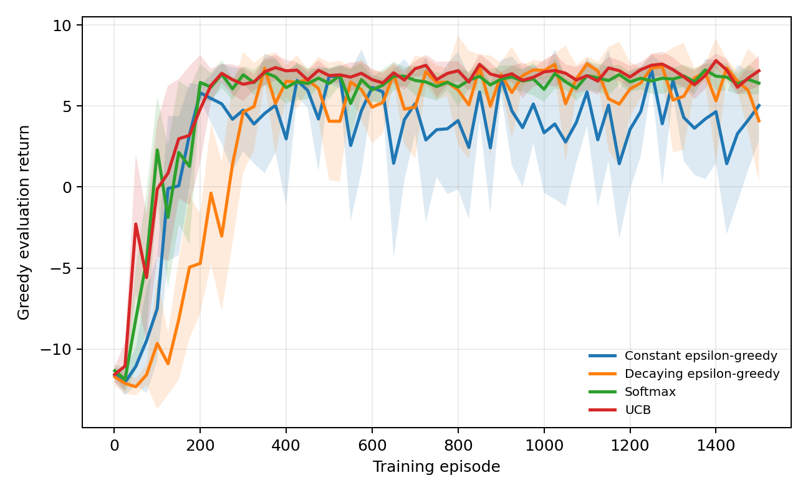
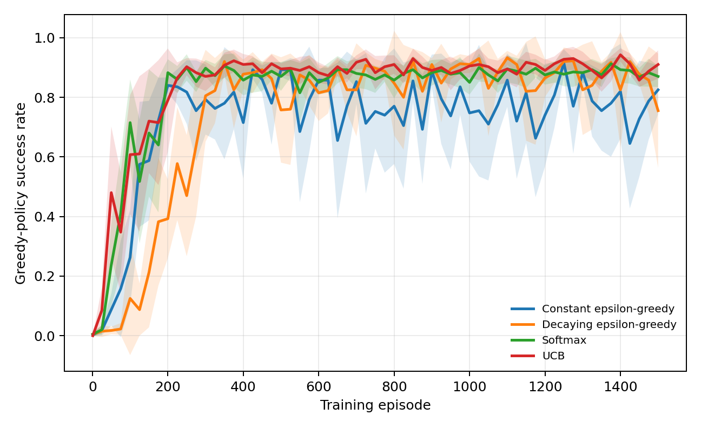
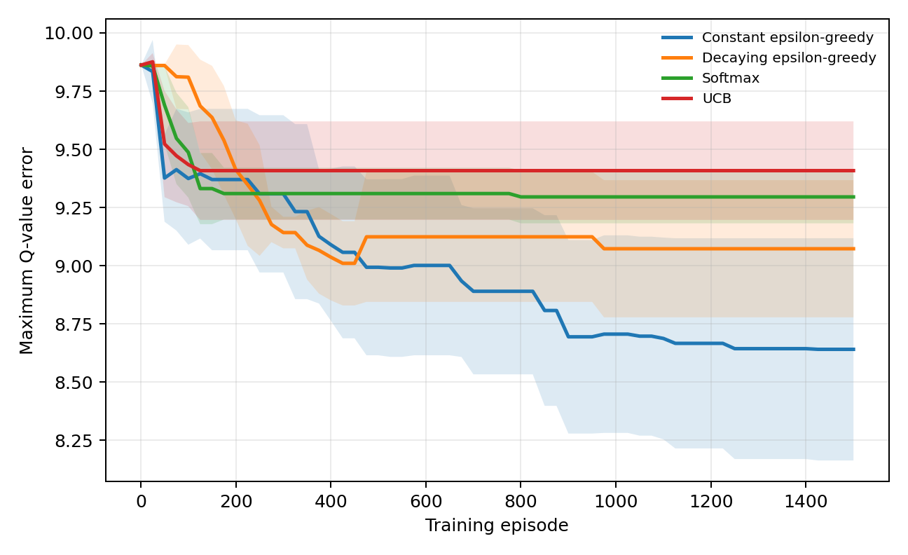

# Exploration Strategies in Tabular Q-Learning


**Author:** Moin Tariq, Muhammad Irfan Haider Khan 
**Programme:** Bachelor of Science in Mathematics  
**Department:** Department of Mathematics and Statistics
**Institution:** International Islamic University, Islamabad  
**Supervisor:** Dr. Nayyar Mehmood


## Abstract

Reinforcement learning studies sequential decisions learned through interaction. A central difficulty is the exploration-exploitation problem: an agent must choose between actions that currently appear successful and actions that may provide useful information. This project compares four exploration strategies for tabular Q-learning: constant epsilon-greedy, decaying epsilon-greedy, softmax, and upper confidence bound (UCB). The algorithms are tested in a finite stochastic grid-world. Exact value iteration supplies the optimal action-value benchmark. Each strategy is trained with ten independent random seeds and assessed using greedy-policy return, success rate, and maximum action-value error. UCB obtains the highest final mean return and success rate, whereas constant epsilon-greedy gives the smallest maximum Q-error. The findings show that policy performance and numerical value accuracy are related but distinct.

**Keywords:** reinforcement learning, Markov decision process, Q-learning, exploration, value iteration

## 1. Introduction

In reinforcement learning (RL), an agent observes a state, chooses an action, receives a reward, and moves to another state. Unlike supervised learning, it is not supplied with the correct action. It must discover useful behaviour from rewards generated by its own decisions.

Exploitation selects an action that currently appears best. Exploration selects a less-certain action to gain information. Too little exploration can produce a poor policy; continual undirected exploration can waste samples and rewards.

The research question is:

> **How does the exploration strategy affect the convergence, stability, and performance of tabular Q-learning in a finite stochastic Markov decision process?**

The objectives are to formulate a grid-world as a finite MDP, compute an exact value-iteration benchmark, implement Q-learning and four exploration rules without an RL library, and compare them over repeated random trials.

## 2. Mathematical background

### 2.1 Markov decision processes

A finite discounted Markov decision process is

$$
\mathcal{M}=(\mathcal{S},\mathcal{A},P,R,\gamma),
$$

where $\mathcal{S}$ and $\mathcal{A}$ are finite state and action spaces, $P(s'\mid s,a)$ is a transition probability, $R(s,a,s')$ is the immediate reward, and $0\leq\gamma<1$ is the discount factor. The return is

$$
G_t=\sum_{k=0}^{\infty}\gamma^kR_{t+k+1}.
$$

The value functions are

$$
V_\pi(s)=\mathbb{E}_\pi[G_t\mid S_t=s],\qquad
Q_\pi(s,a)=\mathbb{E}_\pi[G_t\mid S_t=s,A_t=a].
$$

### 2.2 Bellman optimality and contraction

The optimal action-value function satisfies

$$
Q^*(s,a)=\sum_{s'}P(s'\mid s,a)\left[R(s,a,s')+\gamma\max_bQ^*(s',b)\right].
$$

For the Bellman operator $T$,

$$
\|TQ-TU\|_\infty\leq\gamma\|Q-U\|_\infty.
$$

Thus $T$ is a contraction for $\gamma<1$. The space of finite Q-tables is complete, so the Banach fixed-point theorem gives a unique fixed point $Q^*$. Repeated Bellman updates converge to it. The code uses this result to compute an exact numerical benchmark.

### 2.3 Q-learning

After observing $(S_t,A_t,R_{t+1},S_{t+1})$, Q-learning applies

$$
Q_{t+1}(S_t,A_t)=Q_t(S_t,A_t)+\alpha_t\left[R_{t+1}+\gamma\max_aQ_t(S_{t+1},a)-Q_t(S_t,A_t)\right].
$$

Classical convergence requires repeated visits and learning rates satisfying

$$
\sum_{t=1}^{\infty}\alpha_t=\infty,
\qquad
\sum_{t=1}^{\infty}\alpha_t^2<\infty.
$$

This finite experiment uses constant $\alpha=0.15$ for practical comparison, so exact asymptotic convergence is not claimed.

## 3. Exploration strategies

### 3.1 Constant epsilon-greedy

With probability $\varepsilon=0.10$, select uniformly at random; otherwise select a greedy action:

$$
A_t=\begin{cases}
\text{random action},&\text{with probability }\varepsilon,\\
\arg\max_aQ(S_t,a),&\text{with probability }1-\varepsilon.
\end{cases}
$$

### 3.2 Decaying epsilon-greedy

$$
\varepsilon_k=\max\left(0.02,\;1.0(0.995)^k\right).
$$

This explores heavily at first and becomes increasingly greedy.

### 3.3 Softmax

$$
\Pr(A_t=a\mid S_t=s)=\frac{\exp(Q(s,a)/\tau)}{\sum_b\exp(Q(s,b)/\tau)}.
$$

The temperature decays from $1.0$ to a lower bound of $0.05$. Large temperatures make choices more uniform; small temperatures emphasize high estimates.

### 3.4 Upper confidence bound

$$
A_t=\arg\max_a\left[Q(S_t,a)+c\sqrt{\frac{\log(N(S_t)+1)}{N(S_t,a)}}\right],
$$

where $N(s,a)$ is the action count, $N(s)=\sum_aN(s,a)$, and $c=1$. Untried actions receive priority. This adapts a classical bandit bonus to state-dependent selection.

## 4. Methodology

### 4.1 Environment

The environment is a $6\times6$ grid with 36 states and four actions. The agent starts at the lower-left and seeks the upper-right goal. Five hazard cells terminate an episode. The goal reward is $+10$, a hazard gives $-10$, and an ordinary step gives $-0.1$.

The requested direction occurs with probability $0.90$ and each other direction with probability $0.10/3$. Boundary movements leave the state unchanged. Episodes end at a terminal cell or after 100 steps.

### 4.2 Parameters

| Parameter | Value |
|---|---:|
| Training episodes | 1,500 |
| Independent seeds | 10 |
| Discount factor $\gamma$ | 0.95 |
| Learning rate $\alpha$ | 0.15 |
| Evaluation interval | 25 episodes |
| Evaluation episodes | 40 |
| Maximum length | 100 steps |

### 4.3 Measures

The greedy learned policy is evaluated using mean undiscounted return, probability of reaching the goal, and maximum action-value error

$$
E_Q=\max_{s\notin\mathcal{T},a}|Q(s,a)-Q^*(s,a)|.
$$

Charts show the across-seed mean and approximate 95% confidence interval

$$
\bar{x}\pm1.96\frac{s}{\sqrt{n}}.
$$

## 5. Results

| Strategy | Mean return | Std. dev. | Success | Maximum Q-error |
|---|---:|---:|---:|---:|
| Constant epsilon-greedy | 5.02 | 3.50 | 82.5% | **8.64** |
| Decaying epsilon-greedy | 4.08 | 6.05 | 75.5% | 9.07 |
| Softmax | 6.41 | **1.12** | 87.0% | 9.30 |
| UCB | **7.17** | 1.51 | **91.0%** | 9.41 |



*Figure 1. Mean greedy-policy return; shading is an approximate 95% confidence interval.*



*Figure 2. Mean probability of reaching the goal.*



*Figure 3. Maximum absolute error over nonterminal state-action pairs.*

## 6. Discussion

UCB has the highest final mean return and success rate. Its bonus directs decisions toward less-tried actions and establishes a successful policy quickly. Softmax also performs strongly and has the smallest final return variability. Constant epsilon-greedy is less stable in policy evaluation but attains the lowest maximum Q-error, consistent with continuing random exploration.

These rankings are specific to one environment and parameter configuration. The UCB bonus uses counts but does not fully describe uncertainty propagated through future transitions. A successful greedy policy may coexist with inaccurate values because the best action can remain correctly ranked. Therefore policy quality and Q-value accuracy answer different questions.

## 7. Limitations and extensions

The study uses one small MDP, ten seeds, one setting per method, and a constant learning rate. Hyperparameters were not selected on a separate validation task, and the confidence intervals do not correct for repeated comparisons. Extensions include parameter sensitivity, SARSA, cumulative regret, paired statistical tests, more grid layouts, and offline Q-learning from fixed transition data.

## 8. Conclusion

The project connects exact finite-MDP mathematics with sample-based learning. Bellman contraction gives a unique optimal benchmark; Q-learning estimates it from stochastic transitions. Exploration materially affects learning speed, stability, policy success, and value accuracy. The best-performing policy need not yield the most accurate complete Q-table.

## Reproducibility

The project uses Python 3.10, NumPy 1.23.5, Matplotlib 3.6.3, and python-docx 0.8.11

```bash
python3.10 -m venv .venv
source .venv/bin/activate
pip install -r requirements.txt
python run_experiments.py
python -m unittest discover -s tests -v
```

## References

1. Auer, P., Cesa-Bianchi, N., & Fischer, P. (2002). Finite-time analysis of the multiarmed bandit problem. *Machine Learning, 47*, 235–256. https://doi.org/10.1023/A:1013689704352
2. Bellman, R. (1957). *Dynamic Programming*. Princeton University Press.
3. Farama Foundation. (2022). Announcing the Farama Foundation. https://farama.org/Announcing-The-Farama-Foundation
4. Sutton, R. S., & Barto, A. G. (2018). *Reinforcement Learning: An Introduction* (2nd ed.). MIT Press. http://incompleteideas.net/book/the-book-2nd.html
5. Watkins, C. J. C. H., & Dayan, P. (1992). Q-learning. *Machine Learning, 8*, 279–292. https://doi.org/10.1007/BF00992698

## Appendix: Repository structure

```text
rl_exploration/       environment, planning, policies, and Q-learning
tests/                unit tests
run_experiments.py    multi-seed experiment
report.pdf            Pdf report
report.md             GitHub-rendering report
results/              CSV outputs
figures/              generated charts
```
